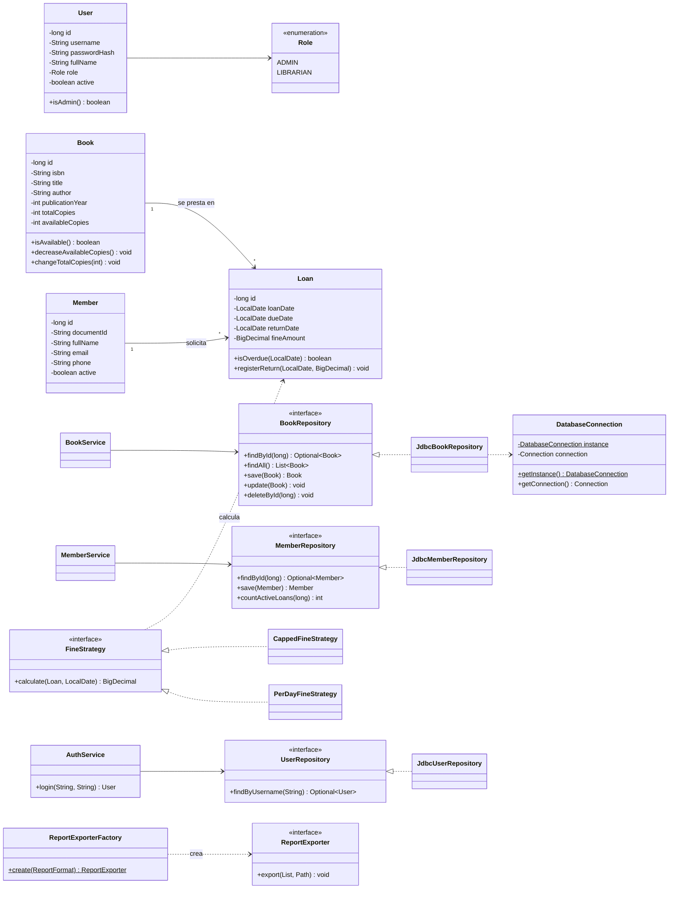

# Diagrama de clases · Fase 1

```mermaid
classDiagram
  direction LR
  class User {
    -long id
    -String username
    -String passwordHash
    -String fullName
    -Role role
    -boolean active
    +isAdmin() boolean
  }
  class Role {
    <<enumeration>>
    ADMIN
    LIBRARIAN
  }
  class Book {
    -long id
    -String isbn
    -String title
    -String author
    -int publicationYear
    -int totalCopies
    -int availableCopies
    +isAvailable() boolean
    +decreaseAvailableCopies() void
    +changeTotalCopies(int) void
  }
  class Member {
    -long id
    -String documentId
    -String fullName
    -String email
    -String phone
    -boolean active
  }
  class Loan {
    -long id
    -LocalDate loanDate
    -LocalDate dueDate
    -LocalDate returnDate
    -BigDecimal fineAmount
    +isOverdue(LocalDate) boolean
    +registerReturn(LocalDate, BigDecimal) void
  }
  class BookRepository {
    <<interface>>
    +findById(long) Optional~Book~
    +findAll() List~Book~
    +save(Book) Book
    +update(Book) void
    +deleteById(long) void
  }
  class MemberRepository {
    <<interface>>
    +findById(long) Optional~Member~
    +save(Member) Member
    +countActiveLoans(long) int
  }
  class UserRepository {
    <<interface>>
    +findByUsername(String) Optional~User~
  }
  class JdbcBookRepository
  class JdbcMemberRepository
  class JdbcUserRepository
  class BookService
  class MemberService
  class AuthService {
    +login(String, String) User
  }
  class DatabaseConnection {
    -DatabaseConnection instance$
    -Connection connection
    +getInstance()$ DatabaseConnection
    +getConnection() Connection
  }
  class FineStrategy {
    <<interface>>
    +calculate(Loan, LocalDate) BigDecimal
  }
  class PerDayFineStrategy
  class CappedFineStrategy
  class ReportExporter {
    <<interface>>
    +export(List, Path) void
  }
  class ReportExporterFactory {
    +create(ReportFormat)$ ReportExporter
  }

  User --> Role
  Member "1" --> "*" Loan : solicita
  Book "1" --> "*" Loan : se presta en
  BookRepository <|.. JdbcBookRepository
  MemberRepository <|.. JdbcMemberRepository
  UserRepository <|.. JdbcUserRepository
  BookService --> BookRepository
  MemberService --> MemberRepository
  AuthService --> UserRepository
  JdbcBookRepository ..> DatabaseConnection
  FineStrategy <|.. PerDayFineStrategy
  FineStrategy <|.. CappedFineStrategy
  FineStrategy ..> Loan : calcula
  ReportExporterFactory ..> ReportExporter : crea
```
